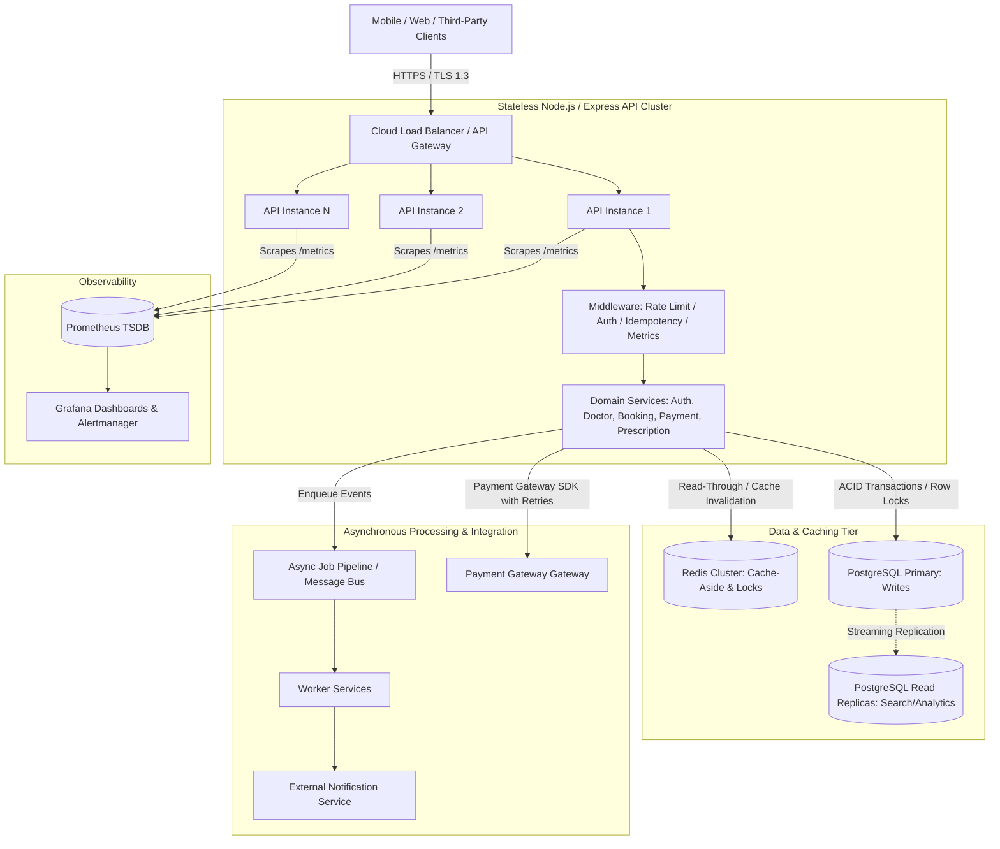
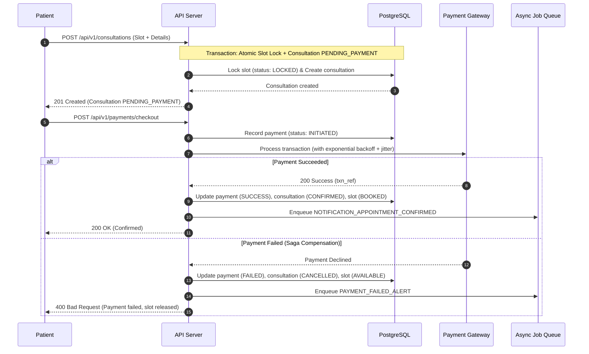

# Amrutam Telemedicine Backend Architecture Document

## 1. Executive Summary & System Goals

Amrutam Telemedicine is a high-concurrency healthcare consultation platform connecting patients with verified Ayurvedic doctors. The system provides real-time practitioner discovery, multi-client slot reservation, stateful consultation management, payment settlement, end-to-end encrypted medical prescriptions, and administrative governance.

### Core Business & Performance Requirements
- **Daily Consultation Volume**: Engineered to process **100,000 completed consultations per day**.
- **Latency Objectives**:
  - P95 read latency for doctor search and cached availability: **< 50 ms**.
  - P99 write latency for booking transactions: **< 150 ms**.
- **System Availability SLA**: **99.95% uptime** (less than 4.38 hours of unscheduled downtime annually).
- **Zero Double-Booking Guarantee**: Absolute consistency preventing duplicate appointment slots under high concurrent booking races.
- **Strict Clinical Data Privacy**: Zero plaintext persistence of Patient Health Information (PHI) such as clinical diagnoses, medications, and medical advice.

---

## 2. High-Level Architecture Diagram



---

## 3. Component Architecture

### 3.1 API & Routing Layer (Express & TypeScript)
- **Stateless HTTP API**: Built with Node.js 22, Express, and strict TypeScript types.
- **Centralized Security Pipeline**:
  - `helmet`: Enforces HTTP security headers (CSP, HSTS, X-Frame-Options).
  - `cors`: Restricts permitted origins.
  - `globalRateLimiter`: Express IP-based sliding rate limiter.
  - `requestLogger`: Winston structured logger generating and propagating W3C `traceparent` and correlation IDs (`cid`).
  - `metricsMiddleware`: Prometheus HTTP latency histogram and counter collector with dynamic route normalization (`:id`).
- **Validation Pipeline**: Zod schemas executed at the boundary (`validateBody`, `validateQuery`, `validateParams`) halting invalid requests before hitting business logic.

### 3.2 Authentication & Authorization (RBAC)
- **Token Architecture**:
  - Short-lived Access Tokens (JWT, 15m lifetime) signed with HMAC-SHA256 (`HS256`).
  - Cryptographically random, opaque Refresh Tokens (48 bytes) hashed with SHA-256 before storage in PostgreSQL (`refresh_tokens` table). Tokens support single-use rotation and explicit revocation.
- **Two-Factor Authentication (TOTP)**:
  - RFC 6238 compliant TOTP using `otplib` and QR code provisioning (`qrcode`).
  - Enforced two-stage authentication flow returning `mfaPending: true` temporary tokens until verified.
- **Role-Based Access Control**:
  - Strict hierarchical permissions: `PATIENT`, `DOCTOR`, and `ADMIN`.
  - Granular route guards verifying role membership and resource ownership (e.g., ensuring a patient can only view their own consultations/prescriptions).

### 3.3 Concurrency Control & Booking Architecture
- **Atomic Slot Reservation**:
  - Prevent concurrent double-booking through PostgreSQL row-level locks and optimistic `lockVersion` counters inside an atomic database transaction (`prisma.$transaction`).
  - Conditional update statement:
    ```sql
    UPDATE availability_slots
    SET status = 'LOCKED', lock_version = lock_version + 1
    WHERE id = :slotId AND doctor_id = :doctorId AND status = 'AVAILABLE' AND lock_version = :currentVersion;
    ```
  - If zero rows are updated, the service immediately aborts and returns an HTTP 409 `ConflictError`.
- **Database Unique Constraints**:
  - Schema-enforced `UNIQUE (slot_id)` constraint on the `consultations` table guarantees at the database engine level that no two consultations can ever link to the same slot.

### 3.4 Write Idempotency Engine
- Enforced on mutating state endpoints: `POST /api/v1/consultations` and `POST /api/v1/payments/checkout`.
- Requires the `Idempotency-Key` HTTP header.
- Calculates deterministic SHA-256 hash of incoming JSON payload with recursive key sorting.
- Lifecycle:
  1. Checks PostgreSQL `idempotency_keys` table for existing key.
  2. If found with identical hash and active TTL (24 hours), replays stored response headers and body without executing transaction.
  3. If found with different payload hash, rejects with `409 ConflictError` (payload mismatch).
  4. If new, registers key and locks request execution to serialize concurrent identical calls.

### 3.5 Payment Saga & Compensation Workflow


### 3.6 Data Encryption at Rest (PHI Protection)
- End-to-end symmetric field encryption using **AES-256-GCM** via Node.js `crypto`.
- Prescriptions store clinical diagnoses, medication lists, and lifestyle instructions as encrypted strings in the format:
  ```
  <iv_hex>:<auth_tag_hex>:<ciphertext_hex>
  ```
- Protects confidentiality even in the event of direct database dump exposure. Decryption occurs exclusively in-memory when accessed by authorized patients, doctors, or administrators.

---

## 4. Architectural Tradeoffs & System Decisions

| Decision | Alternative Considered | Selected Rationale |
| :--- | :--- | :--- |
| **Pessimistic / Optimistic Row Locking** | Distributed Redis Lock (Redlock) | PostgreSQL row locks provide ACID guarantees directly at the data layer, eliminating split-brain risks or distributed clock drift inherent in network-based lock managers. |
| **AES-256-GCM Field Encryption** | Whole-Database TDE Only | Application-level field encryption guarantees data privacy across database backups, replication channels, and unauthorized database administrative queries. |
| **Stateless JWT + DB Refresh Token** | Server-side Redis Sessions | Combines sub-millisecond local token validation for high-throughput reads with immediate revocation capabilities via database refresh token hashing. |
| **Deterministic JSON Hash for Idempotency** | Stringified JSON Hash | Key reordering by client libraries or proxies would otherwise cause false payload mismatch errors; recursive key sorting ensures mathematical determinism. |

---

## 5. Production Recommendations vs Implemented Features

- **Implemented**: Multi-stage Docker containerization, comprehensive Prometheus telemetry, AES-256-GCM field encryption, atomic transaction slot locking, Zod validation, and in-process async event dispatch with retry backoff.
- **Recommended for Clustered Production**:
  - Deploy behind an AWS ALB or Cloudflare Enterprise with WAF and DDoS protection.
  - Transition in-process async job queue to Redis-backed BullMQ or AWS SQS with dead-letter queues.
  - Implement PostgreSQL physical streaming replication with PgBouncer connection pooling.
