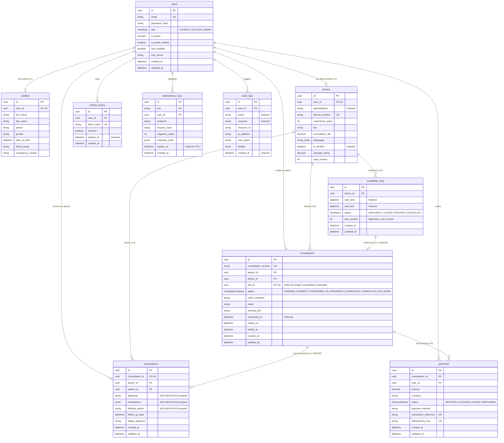

# Database Entity Relationship (ER) Diagram

The following Mermaid ER diagram models the domain entities, relational integrity constraints, and foreign keys implemented in the Amrutam Telemedicine database schema (`prisma/schema.prisma`).

